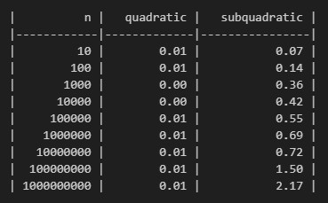

  # CMPS 6610 Problem Set 02
## Answers

**Name:** Seyed Amin Mir Fakhar

Place all written answers from `assignment-01.md` here for easier grading.

To solve these, we'll make use of bounds for **geometric series**, **logarithmic Properties**

For $\\alpha > 1$: $\\:\\:\\: \\sum_{i=0}^n \\alpha^i  = \\frac{\\alpha}{\\alpha - 1}\\cdot\\alpha^n$
 - e.g., $\\sum_{i=0}^{\\lg n} 2^i < \\frac{2}{1} * 2^{\\lg n} = 2n$,

For $\\alpha < 1$: $\\:\\:\\: \\sum_{i=0}^\\infty \\alpha^i  < \\frac{1}{1-\\alpha}$,
- e.g., $\\sum_{i=0}^{\\lg n} \\frac{1}{2^i} < 2$,

1 - $\log {a * b} = \log {a} + \log{b}$ 
- e.g., $\log {n!} =\log n +\log (n-1) +\log (n-2) + ... +\log 1 = \sum_{i=0}^{n} \log {i} $

2 - $\log {a ^ b} = b \log {a}$
- e.g., $\log {n^n} = n \log{n}$

##

1. **Asymptotic notation**
 - Prove that $\log n! \in \Theta(n \log n):$
    - First we can show that  $\log n! \leq c * n \log n. \to n! \leq n^n$ since each element in n! (n, n-1, n-2, ..., 2, 1) is less than or equal to n then it is clear that n! is $\leq n^n $.

2. **Asymptotic notation**
 - $T(n)=2T(n/6)+1$ :

   -   $T(n)=2T(n/6)+1,  T(n/6) = 2T(n/6^2) + 1 \to T(n)=2 * (2T(n/6^2) + 1) + 1 = 2 ^2 T(n/6^2) + 2 + 1$ as we progress furture in the tree we see that $T(n) = \sum_{i=0}^{lg _6{n}} 2^i = n ^ {lg _6{2}}$

- $T(n)=6T(n/4)+n$ :
   -   $T(n)=6T(n/4)+n,  T(n/4) = 6T(n/4^2) + n/4 \to T(n)= 6 * (6T(n/4^2) + n/4) + n = 6 ^2 T(n/4^2) + 6/4 n + n$ on step further $T(n/4^2) = 6 * T(n/4^3) + n/4^2 \to T(n) = 6 ^3 T(n/4^3) + 6^2/4^2 n + 6/4 n + n$ as we progress further in the tree we see that $T(n) = n * \sum_{i=0}^{lg _4{n}} {6/4}^i = n * n ^ {lg _4{1.5}} = n ^ {1 + lg _4{1.5}} = n ^ {lg _4{4 * 1.5}} = n ^ {lg _4{6}}$

- $T(n)=7T(n/7)+n$ :
   -  $T(n)=7T(n/7)+n,  T(n/7) = 7T(n/7^2) + n/7 \to T(n)= 7 * (7T(n/7^2) + n/7) + n = 7 ^2 T(n/7^2) + 7/7 n + n$ as we progress further in the tree we see that $T(n) = \sum_{i=0}^{lg {_7}{n}}{n}  = O(n lg n)$
   - , which is
     $n * \sum_{i=0}^{lg {_7}{n}}{1} = n lg{_7}{n}$

  
- $T(n)=9T(n/4)+n^2$ :
   -   $T(n)=9T(n/4)+n^2,  T(n/4) = 9T(n/4^2) + {n/4}^2 \to T(n)= 9 * (9T(n/4^2) + {n/4}^2) + n^2 = 9 ^2 T(n/4^2) + {9/4^2} n^2 + n^2$ as we progress further in the tree we see that $T(n) = n^2 * \sum_{i=0}^{lg _4{n}} {9/16}^i = n^2 * c = O(n^2)$

- $T(n)=4T(n/2)+n^3$ :
   -   $T(n)=4T(n/2)+n^3,  T(n/2) = 4T(n/2^2) + {n/2}^3 \to T(n)= 4 * (4T(n/2^2) + {n/2}^3) + n^3 = 4 ^2 T(n/2^2) + {4/2^3} n^3 + n^3$ as we progress further in the tree we see that $T(n) = n^3 * \sum_{i=0}^{lg _2{n}} {1/2}^i = n^3 * c = O(n^3)$

- $T(n)=49T(n/25)+n^{3/2}\log n$

   - if we go one layer down on the tree we have $T(n)=49T(n/25)+n^{3/2}\log n,  $T(n/25)=49T(n/256)+{n/25}^{3/2}\log {n/25} \to T(n)=49(49T(n/256)+{n/25}^{3/2}\log {n/25})+n^{3/2}\log n$
     so it is equal to
     $49^{i} (n/25^i)^{3/2} (\log {n} - i \log{25})$
     which shows that this is a root dominant function and we can say $T(n) = O(n^{3/2}\log n)$.

- $T(n)=T(n-1)+2$

    - this goes from n to 1 with constant the work of 2 at each level so it takes linear order, the T(n) = 2*n = O(n)

- $T(n)= T(n-1)+n^c$, with $c\geq 1$

    - this goes from n to 1 with the work of $(n - i)^c$ at i'th level. Each element is less than $n ^c$ (when n, c $\geq$ 1) and we have total of n element to sum up which mean $T(n) \leq n * n ^c = n^ {c+1} = O(n^ {c+1})$

- $T(n)=T(\sqrt{n})+1$

    - this goes from n to $\sqrt{n}$ with the constant work of 1 at each level. so the number of levels is equal to the total work which mean how fast ${{{{n}^{1/2}}^{1/2}}^{...}}$ goes to one which gives us O($log{_2}{log{_2}{n}}$)

---

3. **Algorithm Selection**

- Algorithm $\mathcal{A}$ solves problems by dividing them into
      two subproblems of one fifth of the input size, recursively
      solving each subproblem, and then combining the solutions in quadratic time.

    - $W(n) = 2W(n/5) + n^2 \to W(n) = 4W(n/25) + 2 * (n/5)^2 + n^2$
 so at each level work would be less than the previous one that tells us this is a root dominant function with the 
 $W(n) \in O(n^2)$.
 
    - $S(n) = S(n/5) + n^2 \to S(n) = S(n/25) + (n/5)^2 + n^2$
 so at each level span would be less than the previous one that tells us this is a root dominant function with the 
 $S(n) \in O(n^2)$.

- Algorithm $\mathcal{B}$ solves problems of size $n$ by
      recursively one subproblems of size $n-1$ and then
      combining the solutions in logarithmic time.

   - $W(n) = W(n-1) + log(n) \to W(n) = 4W(n-2) + log(n-1) * log(n)$
 since this goes over the all elements so we would have n term each less than or equal to log(n) so the total work of function is 
 $W(n) \in O(n log(n))$. 
 
    - Also we don't have any recursion to use parallelism so span is as same as work
 $S(n) \in O(n log(n))$.

- Algorithm $\mathcal{C}$ solves problems of size $n$ by dividing
      them into a subproblems of size $n/3$ and a subproblem of size
      $2n/3$, recursively solving each subproblem, and then combining
      the solutions in $O(n^{1.1})$ time.

    - $W(n) = W(n/3) + W(2n/3) + O(n^{1.1}) \to W(n) = W(n/9) + W(2n/9) + (n/3)^{1.1} + W(2n/9) + W(4n/9) + (2n/3)^{1.1} + n^{1.1}$ base on the multiplier we can say
 $(n/3)^{1.1} + (2n/3)^{1.1} \leq n^{1.1}$.
since each one is less than one and the power is greater than one and
$1/3  + 2/3  = 1$
 so the function is root dominated
 $W(n) \in O(n^{1.1})$.
 
    - $S(n) = Max(S(n/3),  S(2n/3)) + O(n^{1.1}) \to S(n) = S(2n/3) + O(n^{1.1})$ this is a root dominant function as well,
 $S(n) \in O(n^{1.1})$.

- Which algorithm would you choose? Why?
    - based on the order of functions work and span, it is better to use B since the $W{_B} < W{_C} < W{_A}$ and $S{_B} < S{_C} < S{_A}$.
---

4. **More Algorithm Selection** 

- Algorithm $\mathcal{A}$ solves problems by dividing them into
      five subproblems of half the size, recursively solving each
      subproblem, and then combining the solutions in linear time.

    - $W(n) = 5W(n/2) + n \to W(n) = 25W(n/4) + 5n/2 + n$
 so at each level work would be greater than the previous one that tells us this is a leaf dominant function with the 
 $W(n) \in O(n ^ {lg{_2}{5}})$.
 
    - $S(n) = S(n/2) + n \to S(n) = S(n/4) + (n/2) + n$
 so at each level span would be less than the previous one that tells us this is a root dominant function with the 
 $S(n) \in O(n)$.

  
	  
- Algorithm $\mathcal{B}$ solves problems of size $n$ by
      recursively solving two subproblems of size $n-1$ and then
      combining the solutions in constant time.

  
 - $W(n) = 2W(n-1) + c \to W(n) = 4W(n-2) + 2c + c \to \sum_{i=0}^{n-1} 2^i = 2 * 2^{n-1}$
 so the total work of function is 
 $W(n) \in O(2^{n})$. 
 
    - $S(n) = S(n-1) + c$  since this goes over the all elements (n) with constant cost of c so, $S(n) = O(n)$

  
		
- Algorithm $\mathcal{C}$ solves problems of size $n$ by dividing
      them into nine subproblems of size $n/3$, recursively solving
      each subproblem, and then combining the solutions in $O(n^2)$
      time.

   - $W(n) = 9W(n/3) + n^2 \to W(n) = 81W(n/9) + 9 * {(n/3)}^2 + n^2$ so the cost is balanced and equal to $n^2$ at each level and we have $\log {_3}{n}$ so $W(n) \in O(n^2 \log n)$. 

   - $S(n) = S(n/3) + n^2 \to S(n) = S(n/9) + {(n/3)}^2 + n^2$ so the cost is reducing at each level by factor of (1/9) then it is root dominant and
     $S(n) = O(n^2)$. 

- Which algorithm would you choose? Why?

    - based on the order of functions work and span, $W{_C} < W{_A} < W{_B}$ and $S{_A} = S{_B} < S{_C}$, if we want to select the efficient algorithm base on their work, C would be our candidate but if we focus on the span, A would be better to use (since B has bigger order of work).

---
 
5. **Integer Multiplication Timing Results**
    -  In contrast with theory, it takes more time for the subquadratic
      $(O(n^{1.585}))$
       multiplication compare with the quadratic one
       $(O(n^{2}))$.
       Probably because of python over loads and internal functions that make rhe quadratic one more efficient than recursively calculating the multiplication.
 

---

6. **Black Hats and White Hats**

- *6a.* Show that if more than $n/2$ students are black hats, you cannot determine which students are white hats based on a pairwise test. Note that you must assume the black hats are conspiring to fool you.

 
  - In this case most of answer pairs only imply that *at least one is black*. since black hats are more in number, they can always trick us to keep at least two labellings of white/black consistent with every other answer pair. so there could be no algorithm to identify the white hats.

 - *6b.* Consider the problem of finding a single white hat, assuming strictly more than $n/2$ of the students are white hats. Show that $n/2$ pairwise interviews is enough to reduce the problem size by a constant fraction. 

   - In this case When whites are more in numbers, if we check each pair-answers:
   - If both say “white,” keep one.
   - Otherwise, toss both.
Each round uses about n/2 interviews and leaves at most n/2 people which still has a white majority. so if we keep to that we can find a white had at last and base on it's answer we can find out about others as well.

---

- *6c.* Using the above show that all white hats can be identified using $\Theta(n)$ pairwise interviews.
  - since we keep half of the people at each step we will end up with (n/2) number of people we started with. so it take log n until we reach the final people. in this way we have
     $\frac{n}{2^i}$ pair to question which shows O(n) in total.
     $T(n) = O(n) + (n-1)$

